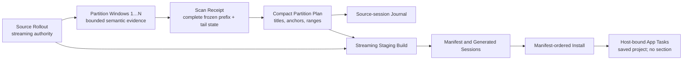

# session-management orchestration-go

Skill-owned Go orchestration for rollout, rename, partition, split, and rehome.

## Install

Use the [repository runtime installer](https://github.com/ronhuafeng/skills-release#runtime-prerequisites)
from a full checkout. A copied Skill directory does not include the shared Go
modules required to build the executable.

Runtime uses only:

```text
session-management <rollout|rename|partition|split|rehome> [arguments]
```

## Partition and split

Rollout JSONL is the persisted authority. `partition inspect` first completes a
bounded-memory source preflight, freezes the append-only source at byte and line
high-water marks, then exposes that prefix through bounded semantic windows.
The caller passes each opaque continuation unchanged. Only the last window
emits a Scan Receipt. A continuation carries no semantic message content; an
over-budget next record is resumed from its exact source cursor. Later appends
do not invalidate the frozen prefix.

Lifecycle scanning follows Codex history projection: a new `task_started`
closes the prior projected Turn even when no terminal event was persisted. A
call remains unresolved until its first matching output; an unresolved call
blocks that boundary. Code-mode may persist multiple custom outputs for one
call, so later outputs are accepted as notifications and do not reopen it. An
active Turn or unresolved call at the selected prefix end is reported as
`tail_open` instead of rejecting the Journal snapshot.

`partition plan` validates the receipt, exact titles, and eligible user-message
anchors. It returns only receipt, titles, anchors, and mechanically derived
complete ranges. Journal accepts an open tail; Split rejects one before output
identity generation. They otherwise share the same plan, and journal never
consumes generated sessions. The Skill-owned semantic review and user-visible
topic projection are defined once in
[`commands/partition.md`](../commands/partition.md).



`split execute` rederives the exact plan and rejects an open tail or unsupported
source lineage before creating UUIDv7 identities. It streams the frozen source
prefix into one current part, calculates range and output proofs incrementally,
validates every expected output line, independently verifies standalone
metadata and dense generated ordinals, rechecks that prefix, and publishes the
complete sibling tree with one no-replace atomic rename. It has no eager or
fallback path.

`split install` accepts only a validated published manifest. It does not
require the original source task to be App-visible. It requires a local
destination or registered SSH host. It resolves the unique native saved
project whose root exactly matches the destination CWD; it does not reuse a
Codex App project ID as a native app-server identity.

Install processes manifest parts in order. Each part uses shared CWD-rebind and
no-clobber rollout-install primitives, then destination app-server activation
and project assignment. It stops at the first unproved effect. It never rolls
back completed parts, deletes an uncertain artifact, removes staging, or
blindly repeats a persistent mutation. App activation is process-local and may
run after a restart only when the new app-server reports the exact task as
`notLoaded`. Final Codex App host-bound readback remains the integration
authority. Sidebar section assignment is outside this command.

The focused [PartitionScan](model/partition/PartitionScan.tla) model checks that
continuations form a prefix, receipts follow complete coverage, plans require a
receipt, publication uses the bound revision, and publication is attempted at
most once. Negative configurations preserve counterexamples for early receipt,
skipped windows, stale publication, and publication retry.

The focused [SplitInstall](model/split-install/SplitInstall.tla) model checks
manifest-order execution, no-clobber installation, at-most-once effects within
one command invocation, stop-after-failure behavior, and the absence of
rollback or staging deletion. It does not model app-server restart. Activation
after restart is allowed only after an exact `notLoaded` readback.

## Other command ownership

- `rollout` streams selected raw lines. Filtered output validates the complete
  source before it emits the first line.
- `rename manifest-targets` validates a published split manifest and returns
  exact ordered task-title mappings. Host mutation and App readback remain
  Skill-owned.
- `rehome establish` owns same-id rollout relocation and exact resume
  invariants. It is not used to install split manifest parts. `rehome
  verify-archive` proves the final archive. SQLite, indexes, Git state, and
  worktrees are never transported or written directly.

Commands return errors at the failing boundary. Read-only calls may be repeated
where their command contract permits. A mutation is never repeated blindly.

## Validation

```bash
GOWORK=off go test ./... -count=1
GOWORK=off go vet ./...
GOWORK=off go build ./cmd/session-management
```
