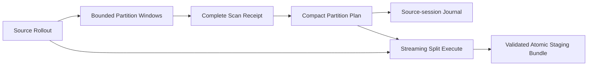

# Stream large rollout partitioning through bounded semantic windows

## Status boundary

This decision replaces the eager partition path and supersedes
[ADR 0005](0005-use-an-eager-full-fidelity-rollout-file-api.md) and
[ADR 0015](0015-separate-content-timeline-from-rollout-metadata.md). It retains
the separation of source provenance, semantic judgment, and physical split
ranges without retaining complete raw or semantic rollouts in memory.

## Problem

The former partition path materialized the complete rollout or semantic
timeline at several boundaries. Its maximum supported source size was therefore
bounded by process memory, command output, and model context. Pagination at only
the inspection boundary would leave planning and execution eager and would add
a second source-revision problem.

The consumer goal is to journal or split an explicitly selected rollout of any
practical size while preserving chronological coverage, legal cut boundaries,
and one authoritative source revision.

## Decision drivers

The replacement must preserve these invariants:

- Rollout JSONL is the persisted evidence authority.
- One frozen source revision binds inspection, planning, and publication.
- Executable code decides where a physical cut is legal.
- Codex decides whether a legal candidate begins a material objective.
- Every source body record belongs to exactly one generated part.
- A cut never crosses an active projected Turn or unresolved call.
- Planning has no external effect.
- Split publishes once, after complete validation, through a no-replace atomic
  mutation.
- Journal and split share semantic titles, anchors, ranges, and source binding.
- Journal may record an open tail; Split may materialize only a closed tail.

## Decision

Use one forward-only partition pipeline:

`rollout-go` remains the only package that owns Codex rollout semantics. It
streams Raw Rollout Lines and exposes narrow facts without a complete in-memory
rollout authority or fallback path.

Inspection exposes bounded semantic windows and mechanically legal anchors.
The caller passes an opaque, source-bound continuation forward. Only complete
coverage produces a receipt. Append-only growth after the selected high-water
mark belongs to a later run; a mismatch inside the selected revision
invalidates the chain.

Codex keeps transient semantic judgment and submits only objective titles and
legal anchors. Planning revalidates the receipt and derives complete ranges. It
does not return a semantic timeline, generated identity, output path, or staging
state.

Journal consumes the compact plan and retained semantic evidence. Split
rederives the same plan, streams the selected source revision into generated
rollouts, validates every output, rechecks the source, and publishes the whole
staging tree with one no-replace atomic rename.

## Authority boundary

- [partition.md](../../catalog/codex-sessions/session-management/commands/partition.md)
  owns semantic inspection and planning behavior.
- [journal.md](../../catalog/codex-sessions/session-management/commands/journal.md)
  and [split.md](../../catalog/codex-sessions/session-management/commands/split.md)
  own their distinct effect and completion contracts.
- The
  [orchestration README](../../catalog/codex-sessions/session-management/orchestration-go/README.md)
  and source own executable mechanics and verification entrypoints.
- This ADR owns only the architectural choice and rejected alternatives.

## Failure and effect boundary

- Incomplete coverage, an invalid anchor, or a changed selected revision
  prevents planning.
- An open tail remains valid journal evidence but prevents Split from creating
  output identities.
- Output validation failure prevents publication.
- An uncertain publication result is read back and is never retried blindly.
- Inspection and planning create no durable scan state or external effect.

## Rejected alternatives

### Add offsets only to inspection

Rejected because planning and execution would remain eager, and caller-authored
offsets could mix revisions or cut semantic records.

### Keep eager and streaming paths

Rejected because parallel readers and partition contracts create duplicate
authority, divergent validation, and permanent compatibility work.

### Persist a scan service or index

Rejected because it adds lifecycle, cleanup, recovery, and stale-state
ownership without changing the semantic result.

### Automatically classify objectives

Rejected because executable code does not own user intent or
consumer-visible outcomes.

### Put the complete timeline in the plan

Rejected because it repeats evidence already reviewed and defeats bounded
semantic exchange.

## Consequences

- Large rollouts use bounded process and model context on the normal path.
- The continuation and receipt protocol is more explicit than an eager local
  call and requires focused invariant tests.
- Journal and split keep one semantic segmentation authority without sharing a
  complete timeline object.
- No deprecated eager facade, migration layer, durable scan state, or fallback
  path remains.

Deterministic tests own streaming order, continuation binding, receipt gates,
range coverage, identity rewriting, and atomic publication invariants. A live
run proves only its recorded source, executable, host, and limits; it does not
become a second current behavior contract.
